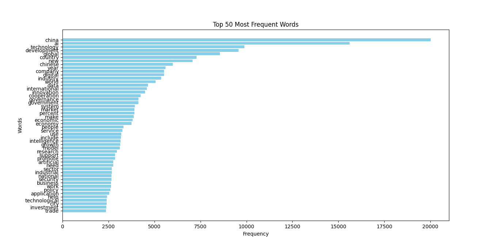
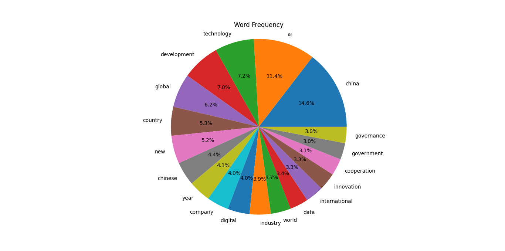

# News-Text-Corpus-Analysis

Drawing on more than 3,000 news articles concerning AI governance retrieved from *China Daily*, this study carries out quantitative NLP analysis. The pipeline covers data collection, cleaning, preprocessing, word-frequency analysis, POS-filtered lemmatisation, LDA topic modelling, and sentiment analysis.

---

## Table of Contents

- [Project Overview](#project-overview)
- [Repository Structure](#repository-structure)
- [Data Pipeline](#data-pipeline)
- [Analysis Modules](#analysis-modules)
- [Output Files](#output-files)
- [Visualisations](#visualisations)
- [Requirements](#requirements)
- [Usage](#usage)

---

## Project Overview

This project builds a corpus from *China Daily* news articles on AI governance and applies a series of quantitative NLP techniques to reveal key topics, vocabulary patterns, and sentiment trends.

**Key analyses performed:**

| Analysis | Method |
|---|---|
| Word frequency | `collections.Counter` |
| POS tagging & lemmatisation | NLTK (`pos_tag`, `WordNetLemmatizer`) |
| Topic modelling | Latent Dirichlet Allocation (scikit-learn) |
| Sentiment analysis | TextBlob polarity scoring |
| Visualisation | Matplotlib bar/pie charts, WordCloud |

---

## Repository Structure

```
News-Text-Corpus-Analysis/
├── code/                                       # All Python scripts
│   ├── data_switch_into_txt.py                 # Step 1 – Extract news text from CSV
│   ├── data_delete_sentence.py                 # Step 2 – Remove boilerplate lines
│   ├── data_process.py                         # Step 3 – Tokenise & remove stop-words
│   ├── data_word_frequency.py                  # Step 4 – Count raw word frequencies
│   ├── data_word_tag_frequency.py              # Step 5 – POS filter & lemmatise
│   ├── data_word_tag_frequency_picture.py      # Bar chart – top 50 words
│   ├── data_word_tag_frequency_piechart.py     # Pie chart – high-frequency words
│   ├── data_word_tag_frequency_wordcloud.py    # Word cloud
│   ├── news_data_rewrite.py                    # Reformat corpus to per-article CSV
│   ├── news_data_LDA_topic_modeling.py         # LDA topic modelling (5 topics)
│   └── news_data_sentiment.py                  # Sentiment analysis (TextBlob)
├── data/                                       # Raw and processed data files
│   ├── 2025-11-29-...-Search Results-....csv   # Raw scraped data (Houyi Collector)
│   ├── data_delete_attribute.csv               # CSV after removing irrelevant columns
│   ├── data_switch_into_txt.txt                # Plain-text corpus (all articles)
│   ├── data_delete_sentence.txt                # Corpus after boilerplate removal
│   ├── data_process.txt                        # Tokenised, stop-word-free corpus
│   ├── data_word_frequency.csv                 # Raw word frequencies
│   ├── data_word_tag_frequency.csv             # POS-filtered, lemmatised frequencies
│   ├── news_data_rewrite.csv                   # Per-article CSV (news_num, news_content)
│   ├── news_data_LDA_classify_result.csv       # Article-level topic assignments
│   ├── news_data_LDA_topic_result.txt          # Top words per LDA topic
│   └── news_data_sentiment.csv                 # Sentiment scores & categories
└── picture/                                    # Generated visualisations
    ├── data_word_tag_frequency_picture.png     # Top-50 words bar chart
    ├── data_word_tag_frequency_piechart.png    # High-frequency word pie chart
    ├── data_word_tag_frequency_wordcloud.png   # Corpus word cloud
    ├── wordart_cluster0.png                    # Word cloud – LDA Topic 0
    ├── wordart_cluster1.png                    # Word cloud – LDA Topic 1
    ├── wordart_cluster2.png                    # Word cloud – LDA Topic 2
    ├── wordart_cluster3.png                    # Word cloud – LDA Topic 3
    └── wordart_cluster4.png                    # Word cloud – LDA Topic 4
```

---

## Data Pipeline

The following steps are executed in order:

```
Raw CSV (Houyi Collector)
        │
        ▼
data_switch_into_txt.py   → Extracts the news-content column and writes each
                             article as a separate block in a plain-text file.
        │
        ▼
data_delete_sentence.py   → Filters out boilerplate lines such as author
                             by-lines, email addresses, and editorial disclaimers.
        │
        ▼
data_process.py           → Tokenises with NLTK, removes punctuation, digits,
                             and stop-words; outputs a clean token list per line.
        │
        ▼
news_data_rewrite.py      → Segments the cleaned text back into individual
                             articles and saves them as a structured CSV with
                             columns [news_num, news_content].
        │
        ├──▶ data_word_frequency.py        → Word frequency table (CSV)
        │         │
        │         ▼
        │    data_word_tag_frequency.py    → POS tagging, lemmatisation, and
        │                                   frequency merging (nouns, verbs,
        │                                   adjectives only)
        │         │
        │         ├──▶ data_word_tag_frequency_picture.py   → Bar chart
        │         ├──▶ data_word_tag_frequency_piechart.py  → Pie chart
        │         └──▶ data_word_tag_frequency_wordcloud.py → Word cloud
        │
        ├──▶ news_data_LDA_topic_modeling.py  → LDA (5 topics), assigns each
        │                                        article to its dominant topic
        │
        └──▶ news_data_sentiment.py           → TextBlob polarity score;
                                                classifies each article as
                                                positive / neutral / negative
```

---

## Analysis Modules

### 1. Data Collection & Extraction (`data_switch_into_txt.py`)

Reads the raw CSV file exported from the Houyi web-scraping tool, extracts the third column (news body), cleans leading/trailing whitespace, and writes each article as a double-newline-separated block.

### 2. Boilerplate Removal (`data_delete_sentence.py`)

Removes lines that match common *China Daily* template patterns:

- Lines ending with `@chinadaily.com.cn` or `@chinadailyusa.com`
- Lines ending with `contributed to this story.`
- Lines starting with `The author is` or `Contact the writers at`
- Lines containing standard editorial disclaimers

### 3. Text Preprocessing (`data_process.py`)

- Strips punctuation and numerals with regular expressions
- Tokenises using `nltk.word_tokenize`
- Removes stop-words from a custom `English_stopwords.txt` list

### 4. Word Frequency Analysis (`data_word_frequency.py`)

Uses `collections.Counter` on the preprocessed tokens; outputs `[Word, Frequency]` rows to CSV.

### 5. POS Tagging & Lemmatisation (`data_word_tag_frequency.py`)

- Tags every word with NLTK `pos_tag`
- Keeps only **nouns** (NN\*), **verbs** (VB\*), and **adjectives** (JJ\*)
- Lemmatises with `WordNetLemmatizer` and merges frequencies of identical lemmas
- Writes results sorted by descending frequency

### 6. LDA Topic Modelling (`news_data_LDA_topic_modeling.py`)

- Builds a document-term matrix with scikit-learn `CountVectorizer` (`min_df=2`, `max_df=0.9`)
- Trains `LatentDirichletAllocation` with **5 topics** (`random_state=42`)
- Assigns each article its dominant topic and records the probability
- Saves per-article topic assignments and prints the top-10 words per topic

### 7. Sentiment Analysis (`news_data_sentiment.py`)

- Computes TextBlob **polarity** (range −1 to +1) for each article's `news_content`
- Classifies as **positive** (> 0.1), **negative** (< −0.1), or **neutral**
- Appends `sentiment_score` and `sentiment_category` columns to the output CSV

---

## Output Files

| File | Description |
|---|---|
| `data/data_switch_into_txt.txt` | Raw plain-text corpus |
| `data/data_delete_sentence.txt` | Corpus without boilerplate |
| `data/data_process.txt` | Preprocessed token corpus |
| `data/data_word_frequency.csv` | `[Word, Frequency]` – all tokens |
| `data/data_word_tag_frequency.csv` | `[Word, Frequency]` – lemmatised nouns/verbs/adjectives |
| `data/news_data_rewrite.csv` | `[news_num, news_content]` – one article per row |
| `data/news_data_LDA_classify_result.csv` | `[news_num, news_content, topic_id, topic_prob]` |
| `data/news_data_LDA_topic_result.txt` | Top words per LDA topic |
| `data/news_data_sentiment.csv` | `[…, sentiment_score, sentiment_category]` |

---

## Visualisations

| File | Description |
|---|---|
| `picture/data_word_tag_frequency_picture.png` | Horizontal bar chart – top 50 most frequent lemmatised words |
| `picture/data_word_tag_frequency_piechart.png` | Pie chart – words with frequency > 4,000 |
| `picture/data_word_tag_frequency_wordcloud.png` | Word cloud from the full lemmatised frequency table |
| `picture/wordart_cluster[0-4].png` | Per-topic word clouds for each of the 5 LDA topics |

### Sample Visualisations

**Top 50 Words (Bar Chart)**



**Word Cloud**


**High-Frequency Word Pie Chart**



---

## Requirements

Install the required Python packages:

```bash
pip install nltk scikit-learn textblob wordcloud pandas matplotlib
```

Download the required NLTK data:

```python
import nltk
nltk.download('punkt')
nltk.download('averaged_perceptron_tagger')
nltk.download('wordnet')
nltk.download('stopwords')
```

---

## Usage

Run the scripts in the following order from the `code/` directory, ensuring the data files are accessible:

```bash
# Step 1 – Extract news text from the raw CSV
python data_switch_into_txt.py

# Step 2 – Remove boilerplate lines
python data_delete_sentence.py

# Step 3 – Tokenise and remove stop-words
python data_process.py

# Step 4 – Count raw word frequencies
python data_word_frequency.py

# Step 5 – POS filtering and lemmatisation
python data_word_tag_frequency.py

# Step 6 – Reformat corpus to per-article CSV (needed for LDA and sentiment)
python news_data_rewrite.py

# Visualisations (can be run after Step 5)
python data_word_tag_frequency_picture.py
python data_word_tag_frequency_piechart.py
python data_word_tag_frequency_wordcloud.py

# LDA topic modelling (requires news_data_rewrite.csv)
python news_data_LDA_topic_modeling.py

# Sentiment analysis (requires news_data_rewrite.csv)
python news_data_sentiment.py
```
